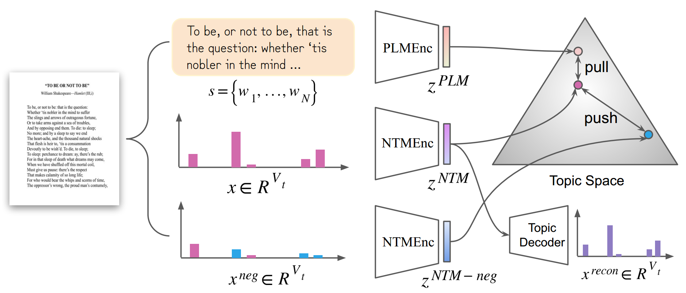

# Improving Neural Topic Models by Contrastive Learning with BERT

This is the official implementation of our paper "Improving Neural Topic Models by Contrastive Learning with BERT".



An overview of our proposed Contrastive BERT-based Topic Model (CBTM). CBTM is a general plug-and-play contrastive learning framework that improves existing neural topic
models by incorporating the knowledge distilled from pre-trained language model (PLMs). For an anchor document, we create its positive sample as the 
linguistic feature extracted from PLMs, and generate its negative sample by perturbed BoW vector. CBTM is trained in an end-to-end paradigm where the contranstive loss 
can be viewed as a regularization to help to improve most neural topic models.


## Getting Started
### Install
- Clone this repo:
```bash
git git@github.com:wds2014/CBTM.git
cd CBTM
```
- Install pytorch with cuda and other requirements as you need.

### Pre-trained language models (PLMs)
We give example of [SBERT](https://arxiv.org/abs/1908.10084) as the PLM, and the pre-trained checkpoints are [here](https://huggingface.co/sentence-transformers/all-mpnet-base-v2).
Note that other BERTs are allowed, and feel free to modify `main.py` and `mydataset.py` to meet your cases. 

### Neural topic model (NTMs)
CBTM allows most VAE-based NTMs as its base model and have the ability to improve their performance. We have provided SawETM, ETM and ProdLDA in `ntms.py`. Users can improve 
their own NTMs according to the detailed code in that file.

### Datasets
- Datasets in our paper

All raw datasets can be downloaded from [google driver](https://drive.google.com/drive/folders/1C2QTp1KMB131sp0XY8qXHILsJyvVF4T8?usp=sharing). All the provided corpus
contain its raw sequential tokens, and we give example of pre-processing in `data_prepare.py`.

- Customising your own datasets

CBTM needs the corpus with its sequential words. Users can prepare their corpus according to the download corpus.

### Training
Users can modify the `parser` in `main.py` to run the different setting, such as the dataset, base neural topic model, the hyperparameter in the final loss and so on.

```bash
python main.py
```

### Evaluation
- Clustering and Classification

We have provided the corresponding codes in `trainer.py` file. Those results are auto-reported during training.
- Topic quality

We have provided the topic diversity in `trainer.py`. For topic coherence, please refer to [Palmetto](https://github.com/dice-group/Palmetto), which is not provided in this repo. One needs to download and set up separately.

### Contact
Feel free to submit a issue or contact to us is you have any problems.

Dongsheng Wang: wds_data [at] 163 [dot] com

